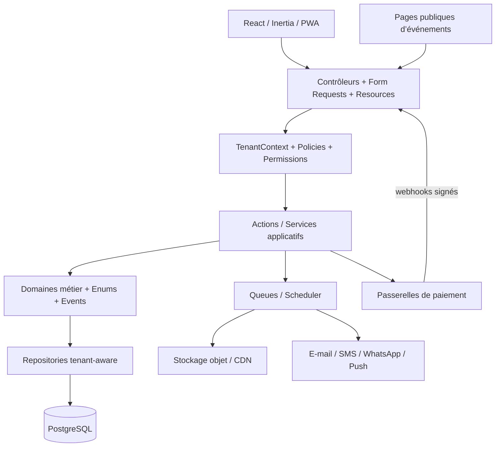
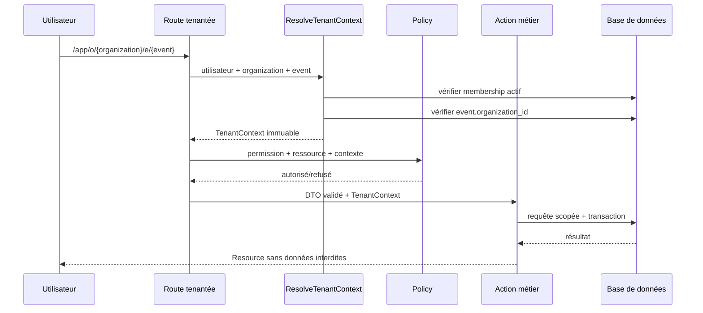
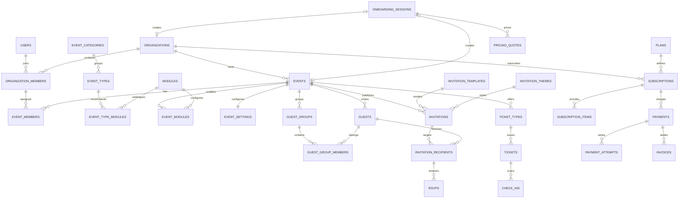
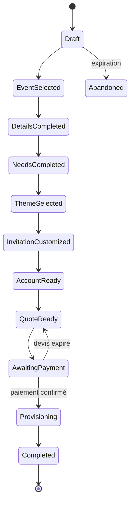
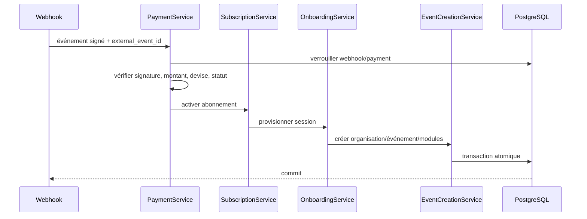

# Planivo — Conception de la plateforme SaaS

Date : 28 juillet 2026  
Prérequis : audit `docs/saas/01-audit.md` validé  
Statut : Phase 2 — contrat d’architecture avant migrations

## 1. Objectifs et principes

L’architecture cible doit permettre :

- plusieurs organisations par utilisateur ;
- plusieurs événements par organisation ;
- des rôles différents selon l’organisation et l’événement ;
- des types d’événements administrables ;
- des modules activables selon le type, le plan et les choix de l’organisateur ;
- une tarification calculée exclusivement côté serveur ;
- des paiements et activations idempotents ;
- une isolation stricte des données ;
- une migration progressive des mariages existants ;
- la conservation des interfaces terrain et du mode hors ligne.

Principes non négociables :

1. Le tenant est l’`Organization`.
2. Un `Event` appartient exactement à une organisation.
3. Aucune ressource métier tenantée ne peut exister sans `organization_id`.
4. Toute ressource propre à un événement porte aussi `event_id`.
5. Le frontend ne décide jamais de l’accès, du prix ou de l’activation.
6. Les anciens identifiants et liens restent résolus pendant la transition.
7. Les opérations critiques sont transactionnelles et idempotentes.
8. Les modules sont des capacités configurables, pas des branches de code copiées.

## 2. Décisions structurantes

### 2.1 Style d’architecture

**Décision : monolithe modulaire Laravel + React/Inertia.**

Ce choix évite la complexité opérationnelle prématurée des microservices, tout en isolant les domaines métier derrière des contrats clairs. Les domaines pourront être extraits plus tard si les volumes ou les équipes le justifient.

Domaines cibles :

- Identity & Access ;
- Organizations ;
- Events & Catalog ;
- Onboarding ;
- Invitations & Guests ;
- Event Operations ;
- Media ;
- Notifications ;
- Billing ;
- Payments ;
- Administration ;
- Audit & Security.

### 2.2 Stratégie multi-tenant

**Décision : schéma partagé, isolation par ligne.**

Toutes les organisations utilisent le même schéma. Les tables tenantées portent `organization_id`; les tables événementielles portent également `event_id`.

Avantages :

- migration progressive compatible avec l’existant ;
- exploitation, sauvegarde et reporting global plus simples ;
- coût inférieur à une base par client ;
- transactions possibles entre abonnement, organisation et événement ;
- adapté au marché visé.

Une base dédiée pourra devenir une option Entreprise ultérieure, derrière les mêmes repositories.

### 2.3 Base de données

**Décision : PostgreSQL en production.**

SQLite reste acceptable pour certains tests locaux, mais la CI doit aussi exécuter les tests d’intégration sur PostgreSQL afin de vérifier :

- transactions concurrentes ;
- contraintes et index composites ;
- verrouillage ;
- JSONB ;
- unicité conditionnelle ;
- recherche et reporting.

Les identifiants métier restent des UUID pour préserver la compatibilité avec les données existantes.

### 2.4 API et frontend

- Inertia reste utilisé pour l’application authentifiée.
- Les opérations métier passent par des endpoints dédiés.
- L’API générique `/api/entities/{entity}` est retirée progressivement.
- Les pages publiques utilisent une API JSON versionnée.
- Les types TypeScript sont générés depuis des Resources/DTO stables.
- TanStack Query reste le gestionnaire de données côté client.
- Les prix et permissions envoyés au frontend sont des projections en lecture seule.

### 2.5 Stockage

- Médias privés par défaut.
- Stockage objet compatible S3 en production.
- Chemins préfixés par organisation et événement.
- URLs temporaires signées pour les ressources privées.
- Miniatures et optimisations générées par jobs.
- Quotas contrôlés avant et après upload.

## 3. Architecture cible



### Flux d’une requête tenantée



## 4. Structure du backend

```text
app/
  Domain/
    Identity/
    Organization/
    Event/
    Invitation/
    Guest/
    Operations/
    Media/
    Billing/
    Payment/
    Notification/
    Audit/
  Application/
    Organization/
      Actions/
      DTO/
      Queries/
    Event/
    Onboarding/
    Invitation/
    Billing/
    Payment/
  Infrastructure/
    Persistence/
      Eloquent/
    Payments/
    Messaging/
    Media/
  Http/
    Controllers/
      App/
      Public/
      Webhooks/
      SuperAdmin/
    Middleware/
    Requests/
    Resources/
    Policies/
```

Services applicatifs requis :

- `TenantAccessService`
- `EventCreationService`
- `EventModuleService`
- `EventPricingService`
- `InvitationService`
- `SubscriptionService`
- `PaymentService`
- `OnboardingService`
- `ThemeRecommendationService`

Règle : un service orchestre les cas d’usage ; les invariants appartiennent aux objets et services de domaine ; les contrôleurs ne font que valider, autoriser, appeler et transformer la réponse.

## 5. Structure du frontend

```text
resources/js/
  app/
    routing/
    providers/
  features/
    auth/
    organizations/
    events/
    onboarding/
    invitations/
    guests/
    tables/
    catering/
    schedule/
    media/
    subscriptions/
    payments/
    settings/
    super-admin/
  shared/
    api/
    components/
    hooks/
    offline/
    types/
```

Chaque feature contient :

```text
api/
components/
hooks/
pages/
schemas/
types/
```

Les menus sont construits depuis une projection serveur :

```ts
type NavigationCapability = {
    module: string;
    route: string;
    label: string;
    icon: string;
    permissions: string[];
};
```

Le frontend filtre l’affichage pour l’ergonomie, mais le backend réévalue toujours la permission.

## 6. Modèle relationnel

### 6.1 Identité et organisations

#### `users`

| Colonne | Type | Contraintes |
|---|---|---|
| id | uuid | PK |
| first_name | varchar | requis |
| last_name | varchar | requis |
| email | citext/varchar | unique, index |
| phone | varchar | nullable, index |
| password | varchar | requis |
| email_verified_at | timestamp | nullable |
| phone_verified_at | timestamp | nullable |
| status | varchar | index |
| locale | varchar(10) | défaut `fr` |
| timezone | varchar | requis |
| last_login_at | timestamp | nullable |
| created_at/updated_at | timestamp | |
| deleted_at | timestamp | nullable |

#### `organizations`

| Colonne | Type | Contraintes |
|---|---|---|
| id | uuid | PK |
| name | varchar | requis |
| slug | varchar | unique |
| owner_user_id | uuid | FK users, index |
| type | varchar | personal, business, agency, venue |
| status | varchar | index |
| country_code | char(2) | |
| currency | char(3) | |
| timezone | varchar | |
| settings | jsonb | défaut `{}` |
| created_at/updated_at | timestamp | |
| deleted_at | timestamp | nullable |

#### `organization_members`

| Colonne | Type | Contraintes |
|---|---|---|
| id | uuid | PK |
| organization_id | uuid | FK, index |
| user_id | uuid | FK, index |
| status | varchar | invited, active, suspended |
| joined_at | timestamp | nullable |
| created_at/updated_at | timestamp | |

Contrainte unique : `(organization_id, user_id)`.

#### `organization_invitations`

- `organization_id`
- `invited_by_user_id`
- `email` ou `phone`
- `token_hash`
- `expires_at`
- `accepted_at`
- `status`
- rôles proposés

Le jeton brut n’est jamais stocké.

### 6.2 Rôles et permissions

#### `roles`

- `id`
- `organization_id` nullable pour les rôles système ;
- `name`
- `slug`
- `scope`: organization ou event ;
- `is_system`
- `created_at`, `updated_at`

Unicité : `(organization_id, slug, scope)`.

#### `permissions`

- `id`
- `key` unique, par exemple `guests.create` ;
- `module_slug`
- `description`

#### `role_permissions`

Clé unique `(role_id, permission_id)`.

#### `organization_member_roles`

Clé unique `(organization_member_id, role_id)`.

#### `event_members`

- `event_id`
- `organization_member_id`
- `status`
- `assigned_at`

Contrainte unique : `(event_id, organization_member_id)`.

#### `event_member_roles`

Clé unique `(event_member_id, role_id)`.

### 6.3 Catalogue d’événements

#### `event_categories`

- `id`
- `name`
- `slug` unique
- `description`
- `icon`
- `color`
- `sort_order`
- `status`

Valeurs initiales : personnel, familial, professionnel, public, commémoratif.

#### `event_types`

- `id`
- `event_category_id`
- `name`
- `slug` unique
- `description`
- `image_media_id` nullable
- `icon`
- `status`
- `primary_color`
- `custom_fields_schema` JSONB versionné
- `pricing_metadata` JSONB
- `limits` JSONB
- `sort_order`
- timestamps

Les types initiaux sont seedés, mais restent administrables.

#### `modules`

- `id`
- `name`
- `slug` unique
- `description`
- `icon`
- `status`
- `category`
- `dependencies` JSONB
- `configuration_schema` JSONB versionné
- `sort_order`

#### `event_type_modules`

- `event_type_id`
- `module_id`
- `recommendation_level`: required, recommended, optional, hidden
- `default_enabled`
- `configuration_defaults` JSONB
- `sort_order`

Unique : `(event_type_id, module_id)`.

### 6.4 Événements

#### `events`

| Colonne | Type | Contraintes |
|---|---|---|
| id | uuid | PK |
| organization_id | uuid | FK, index |
| event_type_id | uuid | FK, index |
| created_by_user_id | uuid | FK |
| name | varchar | requis |
| slug | varchar | index |
| status | varchar | draft, pending_payment, active, completed, archived, cancelled |
| starts_at | timestamptz | index |
| ends_at | timestamptz | nullable |
| timezone | varchar | requis |
| format | varchar | physical, virtual, hybrid |
| venue_name | varchar | nullable |
| venue_address | text | nullable |
| city | varchar | nullable |
| country_code | char(2) | nullable |
| virtual_url | text | nullable, chiffré si privé |
| estimated_guests | integer | >= 0 |
| visibility | varchar | public, link, code, invitation |
| age_range_type | varchar | nullable |
| custom_age_min/max | integer | nullable |
| cover_media_id | uuid | nullable |
| legacy_wedding_id | uuid | nullable, unique pendant migration |
| created_at/updated_at | timestamp | |
| deleted_at | timestamp | nullable |

Unicité : `(organization_id, slug)`.

#### `event_settings`

- `event_id` unique ;
- `organization_id` ;
- `locale` ;
- `branding` JSONB ;
- `public_page` JSONB versionné ;
- `privacy` JSONB ;
- `communication` JSONB ;
- `feature_flags` JSONB ;
- timestamps.

#### `event_modules`

- `organization_id`
- `event_id`
- `module_id`
- `status`: enabled, disabled, suspended
- `source`: type_default, onboarding, plan, admin
- `configuration` JSONB versionné
- `enabled_at`
- `disabled_at`

Unique : `(event_id, module_id)`.

#### `event_custom_fields`

- `organization_id`
- `event_id`
- `key`
- `label`
- `type`
- `options` JSONB
- `validation_rules` JSONB
- `visibility`
- `sort_order`

Unique : `(event_id, key)`.

### 6.5 Invitations et invités

#### `guests`

- `organization_id`
- `event_id`
- identité et coordonnées ;
- langue et fuseau ;
- statut opérationnel ;
- notes privées ;
- données alimentaires ;
- `source`;
- timestamps et soft delete.

Index : `(event_id, status)`, `(event_id, email)`, `(event_id, phone)`.

#### `guest_groups`

- `organization_id`
- `event_id`
- `name`
- `type`: family, company, household, custom
- `max_attendees`

#### `guest_group_members`

Unique : `(guest_group_id, guest_id)`.

#### `invitation_templates`

- propriétaire plateforme ou organisation ;
- type d’événement ;
- tranches d’âge compatibles ;
- catégories de style ;
- schéma de contenu ;
- schéma de personnalisation ;
- statut et version.

#### `invitation_themes`

- template ;
- couleurs, polices, assets ;
- critères de recommandation ;
- statut et version.

#### `invitations`

- `organization_id`
- `event_id`
- `template_id`
- `theme_id`
- `type`: generic, named, individual, family, group, ticketed
- `status`: draft, scheduled, sent, opened, expired, revoked
- contenu JSONB versionné ;
- limites d’usage ;
- `access_policy`;
- `expires_at`;
- timestamps.

#### `invitation_recipients`

- `invitation_id`
- `guest_id` nullable
- `guest_group_id` nullable
- `token_hash` unique
- `recipient_name`
- `recipient_email`
- `recipient_phone`
- `max_attendees`
- `sent_at`, `opened_at`, `used_at`, `revoked_at`

Contrainte : exactement un destinataire logique selon le type.

#### `rsvps`

- `organization_id`
- `event_id`
- `invitation_recipient_id`
- `guest_id`
- `status`: attending, declined, maybe
- `attendee_count`
- `answers` JSONB
- `responded_at`
- `source`

Conserver un historique ou une version, plutôt qu’écraser silencieusement la réponse.

### 6.6 Billetterie et accès

#### `ticket_types`

- événement, nom, capacité, prix, devise ;
- période de vente ;
- règles et statut.

#### `tickets`

- événement ;
- type ;
- propriétaire/destinataire ;
- code hashé ;
- statut ;
- paiement associé ;
- dates d’émission et d’expiration.

#### `check_ins`

- événement ;
- ticket ou invitation ;
- agent ;
- terminal ;
- horodatage ;
- résultat ;
- clé d’idempotence.

Unique : `(event_id, idempotency_key)`.

### 6.7 Facturation et paiements

#### `plans`

- `name`, `slug`, `status`
- modèle : per_event, monthly, annual, enterprise
- devise et prix de base ;
- limites JSONB pour lecture ;
- version et période de validité.

#### `plan_features`

- `plan_id`
- `feature_key`
- `value_type`
- valeur booléenne, numérique ou texte
- `overage_policy`

Unique : `(plan_id, feature_key)`.

#### `pricing_rules`

- portée : globale, plan, type d’événement, module ;
- condition JSONB ;
- opération : fixed, percentage, per_unit, tiered ;
- priorité ;
- période de validité ;
- version.

#### `pricing_quotes`

- `organization_id` nullable avant création ;
- `onboarding_session_id` ;
- devise ;
- sous-total, remise, taxe, total en unités mineures ;
- snapshot détaillé JSONB ;
- version du moteur ;
- expiration ;
- hash d’intégrité.

#### `subscriptions`

- organisation ;
- plan ;
- événement nullable pour un forfait par événement ;
- statut ;
- dates de période, grâce, annulation ;
- référence fournisseur ;
- snapshot du plan.

#### `subscription_items`

- subscription ;
- feature/module ;
- quantité ;
- prix unitaire ;
- limites.

#### `payments`

- organisation ;
- quote ;
- subscription ;
- montant et devise en unités mineures ;
- statut ;
- provider ;
- référence externe unique ;
- idempotency_key unique ;
- paid_at ;
- métadonnées filtrées.

#### `payment_attempts`

- payment ;
- numéro d’essai ;
- statut ;
- provider_request_id ;
- réponse normalisée ;
- erreur ;
- timestamps.

#### `invoices`

- organisation ;
- subscription/payment ;
- numéro unique ;
- montants ;
- statut ;
- dates ;
- snapshot d’identité de facturation ;
- PDF media id.

#### `payment_webhook_events`

- provider ;
- external_event_id ;
- signature_valid ;
- payload chiffré ou expurgé ;
- statut de traitement ;
- tentatives ;
- processed_at.

Unique : `(provider, external_event_id)`.

### 6.8 Onboarding

#### `onboarding_sessions`

- `id`
- `user_id` nullable avant compte
- `organization_id` nullable
- `event_id` nullable
- `resume_token_hash` nullable
- `current_step`
- `status`: draft, awaiting_account, awaiting_payment, completed, abandoned
- `payload` JSONB versionné
- `version`
- `expires_at`
- timestamps.

#### `onboarding_step_snapshots`

- session ;
- étape ;
- payload validé ;
- version ;
- completed_at.

Unique : `(onboarding_session_id, step, version)`.

### 6.9 Audit et notifications

#### `activity_logs`

- `organization_id`
- `event_id` nullable
- `actor_user_id` nullable
- `action`
- type/id du sujet
- avant/après expurgés
- IP, user agent, request id
- timestamp immuable.

#### `notifications`

- tenant et event ;
- type ;
- contenu structuré ;
- priorité ;
- source/idempotency key ;
- date de programmation.

#### `notification_deliveries`

- notification ;
- utilisateur ou destinataire ;
- canal ;
- statut ;
- provider reference ;
- tentatives et dates.

## 7. Diagramme des entités principales



## 8. Isolation multi-tenant

### 8.1 TenantContext

Objet immuable requis pour tout cas d’usage tenanté :

```php
final readonly class TenantContext
{
    public function __construct(
        public string $organizationId,
        public string $userId,
        public ?string $eventId,
        public array $permissions,
        public bool $isSuperAdmin = false,
    ) {}
}
```

Il est résolu depuis :

1. la route explicite ;
2. l’utilisateur authentifié ;
3. un membership actif ;
4. l’appartenance de l’événement à l’organisation.

Le client ne peut jamais fournir librement `organization_id`.

### 8.2 Défenses en profondeur

- Middleware de résolution.
- Policies par ressource.
- Repositories exigeant `TenantContext`.
- Scopes Eloquent.
- Clés étrangères.
- Unicités composites incluant le tenant.
- Tests d’accès négatifs.
- Logs des refus.
- Pour les opérations sensibles, vérification explicite dans l’Action.

Les global scopes seuls ne suffisent pas, car ils peuvent être désactivés ou oubliés dans des requêtes administratives.

### 8.3 Super administration

Le super administrateur :

- possède une permission plateforme distincte ;
- utilise des routes `/super-admin` ;
- doit confirmer les actions sensibles ;
- génère un journal d’activité ;
- ne réutilise pas le rôle `admin` d’une organisation ;
- ne peut pas « devenir » un utilisateur sans mécanisme d’impersonation audité et limité.

### 8.4 Stockage hors ligne

Le namespace local devient :

```text
planivo:{user_id}:{organization_id}:{event_id}:v2
```

Chaque opération en file contient :

- l’utilisateur ;
- l’organisation ;
- l’événement ;
- la session d’origine ;
- une clé d’idempotence ;
- une date d’expiration ;
- la version du payload.

La synchronisation refuse tout contexte différent. La déconnexion purge les données privées ou les chiffre avec une clé de session non réutilisable.

## 9. Rôles et permissions

### 9.1 Rôles initiaux

| Rôle | Portée |
|---|---|
| Propriétaire | Organisation |
| Administrateur | Organisation |
| Organisateur | Événement |
| Coordinateur | Événement |
| Responsable invités | Événement |
| Responsable stock | Événement |
| Responsable financier | Événement |
| Photographe | Événement |
| Prestataire | Événement |
| Agent d’accueil | Événement |
| Contrôleur d’accès | Événement |
| Lecture seule | Organisation ou événement |

### 9.2 Matrice initiale

Légende : G = gérer, V = voir, — = aucun accès.

| Capacité | Propriétaire | Admin | Organisateur | Invités | Finance | Accueil | Lecture |
|---|---:|---:|---:|---:|---:|---:|---:|
| Paramètres organisation | G | G | — | — | — | — | V |
| Membres et rôles | G | G | — | — | — | — | V |
| Créer un événement | G | G | G | — | — | — | — |
| Paramètres événement | G | G | G | — | — | — | V |
| Invités et RSVP | G | G | G | G | — | V limité | V |
| Invitations | G | G | G | G | — | — | V |
| Budget et dépenses | G | G | G | — | G | — | V selon règle |
| Stock | G | G | G | — | V | — | V |
| Médias | G | G | G | — | — | — | V |
| Check-in | G | G | G | V | — | G | V |
| Abonnement et paiement | G | V | — | — | V | — | — |
| Suppression événement | G | Veto/configurable | — | — | — | — | — |

Permissions atomiques :

```text
organization.view
organization.update
organization.members.invite
organization.members.manage
event.create
event.view
event.update
event.archive
event.delete
event.modules.manage
guests.view
guests.create
guests.update
guests.delete
invitations.view
invitations.manage
rsvps.manage
budget.view
budget.manage
expenses.approve
stock.view
stock.manage
media.publish
checkins.scan
settings.manage
billing.view
billing.manage
reports.export
activity.view
```

## 10. Catalogue de modules

### 10.1 Modules initiaux

| Slug | Module | Dépendances |
|---|---|---|
| guests | Invités | aucune |
| invitations | Invitations | guests |
| rsvps | RSVP | guests, invitations |
| seating | Tables et placement | guests |
| schedule | Programme | aucune |
| tasks | Tâches | aucune |
| budget | Budget | aucune |
| expenses | Dépenses | budget |
| stock | Stock | aucune |
| purchasing | Achats | stock ou budget |
| staff | Personnel | aucune |
| vendors | Prestataires | aucune |
| contracts | Contrats | vendors, documents |
| documents | Documents | aucune |
| gallery | Galerie | media |
| media | Médias | aucune |
| ticketing | Billetterie | payments facultatif |
| qr_access | QR et contrôle d’accès | guests ou ticketing |
| badges | Badges | guests ou ticketing |
| catering | Repas et menus | guests facultatif |
| gifts | Cadeaux | guests facultatif |
| accommodation | Hébergement | guests |
| transport | Transport | guests |
| notifications | Notifications | aucune |
| messaging | Messagerie | notifications |
| forms | Formulaires | aucune |
| reports | Rapports | modules sources |
| analytics | Statistiques | modules sources |

### 10.2 Résolution d’activation

```text
modules du type d’événement
        +
choix de l’onboarding
        +
dépendances obligatoires
        -
modules interdits par le plan
        +
options payantes validées
        =
projection effective des modules
```

`EventModuleService` :

1. charge le catalogue et ses versions ;
2. résout les dépendances ;
3. vérifie les limites du plan ;
4. calcule les options facturables ;
5. persiste la configuration ;
6. émet `EventModulesChanged`.

Un module requis ne peut pas être désactivé sans désactiver les modules dépendants.

## 11. Tranches d’âge et recommandations

Enum initial :

```text
infant: 0–2
preschool: 3–6
child: 7–12
teen: 13–17
young_adult: 18–25
adult: 26–49
senior: 50+
custom
```

Les recommandations utilisent des tags pondérés :

- type d’événement ;
- tranche d’âge ;
- style ;
- saison ;
- formalité ;
- palette ;
- contexte culturel ;
- budget.

`ThemeRecommendationService` retourne des scores et des explications. Les résultats ne bloquent jamais la sélection manuelle et ne déduisent pas de caractéristiques sensibles.

## 12. Parcours d’onboarding

### 12.1 États



### 12.2 Étapes

1. Type et catégorie d’événement.
2. Informations générales dynamiques.
3. Besoins et modules.
4. Recommandations de thèmes.
5. Personnalisation d’invitation.
6. Création ou connexion du compte.
7. Devis serveur.
8. Paiement.

Chaque étape :

- possède une validation frontend d’ergonomie ;
- est validée à nouveau côté backend ;
- produit un snapshot versionné ;
- peut être reprise ;
- n’autorise pas de sauter une dépendance ;
- ne crée pas définitivement l’événement avant le moment prévu par le modèle commercial.

### 12.3 Provisionnement

Après confirmation du paiement :



Toute répétition retourne le résultat déjà provisionné.

## 13. Tarification

### Entrées autorisées

- type d’événement ;
- invités estimés ;
- utilisateurs ;
- modules ;
- durée ;
- stockage ;
- volumes de messages ;
- billets ;
- domaine ;
- template premium ;
- assistance.

### Sortie

Un `PricingQuote` immuable contient :

- lignes de prix ;
- quantités ;
- règles appliquées ;
- remises ;
- taxes ;
- devise ;
- total ;
- date d’expiration ;
- version du moteur ;
- hash d’intégrité.

Tous les montants sont stockés en unités mineures entières. Aucun calcul financier ne repose sur des nombres flottants.

### Invariants

- Le client envoie des choix, jamais un total de confiance.
- Le paiement référence un devis non expiré.
- Le montant de la passerelle doit correspondre au devis.
- Toute modification du périmètre crée un nouveau devis.
- Le snapshot du plan protège l’historique des factures.

## 14. Paiements et webhooks

Interface fournisseur :

```php
interface PaymentGateway
{
    public function createIntent(PaymentIntentData $data): GatewayIntent;
    public function verifyWebhook(SignedWebhook $webhook): VerifiedGatewayEvent;
    public function fetchTransaction(string $reference): GatewayTransaction;
    public function refund(RefundData $data): GatewayRefund;
}
```

Adaptateurs possibles :

- Mobile Money ;
- carte ;
- virement ;
- paiement manuel ;
- portefeuille.

Le paiement manuel exige :

- permission dédiée ;
- preuve ;
- double confirmation configurable ;
- activité auditée ;
- impossibilité pour l’auteur de valider sa propre demande si la règle est activée.

## 15. Pages publiques et confidentialité

Route canonique :

```text
/e/{eventPublicSlug}
```

Le slug public est distinct du slug interne d’organisation. Les domaines personnalisés sont résolus vers un événement actif.

Modes :

- public ;
- lien non indexé ;
- code ;
- invitation ;
- invitation nominative ;
- usage unique.

La projection publique est produite par une Resource dédiée. Elle ne sérialise jamais directement les modèles Eloquent.

Données interdites par défaut :

- e-mail et téléphone des invités ;
- restrictions alimentaires ;
- notes internes ;
- autres membres d’une table ;
- références de paiement ;
- paramètres privés ;
- identité des collaborateurs non publiés.

## 16. Contrats applicatifs principaux

### Routes authentifiées

```text
GET    /app/organizations
POST   /app/organizations
GET    /app/o/{organization}/events
POST   /app/o/{organization}/events
GET    /app/o/{organization}/e/{event}
PATCH  /app/o/{organization}/e/{event}
GET    /api/o/{organization}/e/{event}/capabilities
GET    /api/o/{organization}/e/{event}/modules
PUT    /api/o/{organization}/e/{event}/modules
```

### Onboarding

```text
POST   /api/onboarding-sessions
GET    /api/onboarding-sessions/{session}
PUT    /api/onboarding-sessions/{session}/steps/{step}
POST   /api/onboarding-sessions/{session}/quote
POST   /api/onboarding-sessions/{session}/payment-intent
GET    /api/onboarding-sessions/{session}/status
```

### Public et webhooks

```text
GET    /api/public/events/{slug}
GET    /api/public/invitations/{token}
POST   /api/public/invitations/{token}/rsvp
POST   /api/public/check-ins
POST   /api/webhooks/payments/{provider}
```

Les routes publiques ont rate limits, détection d’abus et réponses minimales.

## 17. Événements métier et traitements asynchrones

Événements principaux :

```text
OrganizationCreated
OrganizationMemberInvited
EventCreated
EventModulesChanged
InvitationScheduled
InvitationSent
InvitationOpened
RsvpReceived
GuestCheckedIn
PricingQuoteCreated
PaymentConfirmed
PaymentFailed
SubscriptionActivated
SubscriptionExpiring
MediaUploaded
StockThresholdReached
```

Jobs :

- envoi d’invitations ;
- génération PDF/image ;
- SMS/WhatsApp/e-mail ;
- traitement média ;
- exports ;
- factures ;
- notifications planifiées ;
- rapprochement des paiements ;
- rapports de migration.

Chaque job porte `organization_id`, `event_id`, un correlation id et une clé d’idempotence.

## 18. Stratégie de cache

Clés :

```text
planivo:{environment}:{organization_id}:{event_id}:{resource}:{version}
```

Règles :

- aucune donnée tenantée sans tenant dans la clé ;
- invalidation par événements métier ;
- TTL court pour capacités et permissions ;
- pas de cache partagé des pages privées ;
- purge lors de suspension d’un membership ;
- données publiques séparées des données privées.

## 19. Contraintes et suppressions

### Suppression

- Organization : soft delete, traitement asynchrone après délai légal.
- Event : archivage puis soft delete.
- Paiements, factures, audit : jamais supprimés en cascade.
- Guests : anonymisation possible selon politique.
- Invitations : révocation, puis conservation minimale.
- Media : suppression différée après vérification des références.

### Index obligatoires

Chaque table tenantée reçoit au minimum :

- index `organization_id` ;
- index `event_id` si présent ;
- index composites correspondant aux listes ;
- index `status` lorsque filtré ;
- index `created_at` pour pagination ;
- unicités incluant le tenant.

Exemples :

```text
events (organization_id, status, starts_at)
guests (organization_id, event_id, status)
invitations (organization_id, event_id, status)
payments (organization_id, status, created_at)
activity_logs (organization_id, event_id, created_at)
```

## 20. Invariants de sécurité testables

1. Une ressource d’une autre organisation retourne 404 ou 403 sans révéler son existence.
2. Changer un `organization_id` dans le payload n’a aucun effet.
3. Un événement ne peut référencer qu’un type actif.
4. Un `event_id` doit appartenir au même `organization_id`.
5. Une permission frontend absente n’est jamais le seul contrôle.
6. Un jeton public est hashé, révocable et expirant.
7. Un webhook invalide ne modifie aucun paiement.
8. Un webhook répété ne provisionne pas deux fois.
9. Une file hors ligne ne se synchronise pas sous un autre contexte.
10. Une suppression d’événement ne supprime pas les pièces comptables.

## 21. Critères d’acceptation de la conception

La phase 3 peut commencer lorsque les points suivants sont acceptés :

- monolithe modulaire ;
- PostgreSQL en production ;
- schéma partagé tenanté par `organization_id` ;
- routes avec organisation et événement explicites ;
- rôles de membership et permissions granulaires ;
- modèle de modules et dépendances ;
- séparation guests/invitations/RSVP ;
- devis immuable et paiements idempotents ;
- stratégie expand/contract pour les mariages existants ;
- conservation temporaire des routes et identifiants historiques.

## 22. Décisions reportées

Ces choix ne bloquent pas les migrations de fondation :

- fournisseur Mobile Money ;
- fournisseur carte bancaire ;
- fournisseur WhatsApp/SMS ;
- règles fiscales par pays ;
- prix commerciaux définitifs ;
- domaines personnalisés ;
- stockage objet final ;
- moteur de recherche global.

Ils doivent rester derrière des interfaces configurables.

## 23. Livrable suivant

La phase suivante est le **plan de migration** :

1. migrations additives ;
2. tables de correspondance ;
3. backfill des données historiques ;
4. dual-read et dual-write ;
5. vérifications de cohérence ;
6. rollback ;
7. déploiement progressif ;
8. tests de migration.

Aucune ancienne table ne sera supprimée pendant cette phase.
